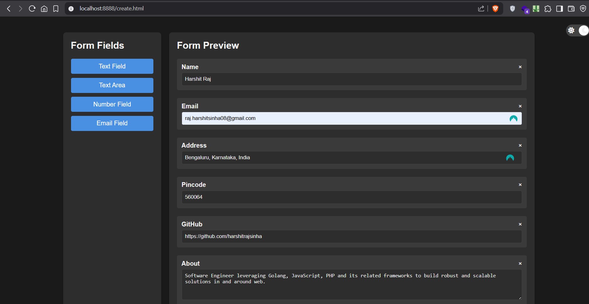
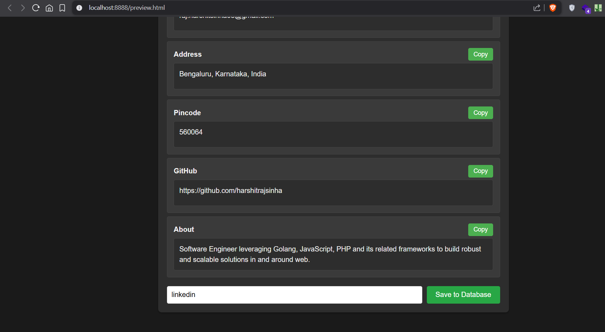
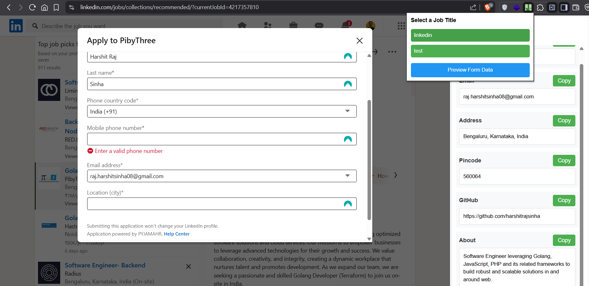

# Job Form Builder

## Problem Statement

Job portals often have varying data requirements for applicants, and some even disable auto-fill options. As a result, we are forced to manually save our personal information in external tools (e.g., Word, Notepad, or Notion) and repeatedly switch between applications to copy and paste the information when filling out job applications.

## Solution

Job Form Builder is a user-friendly web application designed to streamline the job application process. It allows users to create and store a customized form containing personal information. Once created, this form can be easily accessed in job portal forms via a Chrome extension, eliminating the need to constantly switch between tabs or applications.

## Features

- Create Job details for different title/role/purpose
- Save to local database (Info remains on your system)
- Edit existing form

## How to use

1. Make sure you have Docker installed on your system - [Docker](https://www.docker.com/)

2. Start Docker

3. Open bash or any terminal and clone this repository -

```bash
git clone https://github.com/harshitrajsinha/job-form-builder
```

4. Navigate to /job-form-builder

```bash
cd job-form-builder
```

5. Set environment variables (refer .env.example)

- You can set your desired DB_USER, DB_PASS, DB_NAME

5. Run docker-compose

```bash
docker-compose up --build
```

6. Access the application

**Index** - http://localhost:8888/index.html \
**Create Form** - http://localhost:8888/create.html \
**Preview Form** - http://localhost:8888/preview.html \
**Edit Form** - http://localhost:8888/edit.html

7. Setup Chrome extension \
   Browser -> Extensions -> Manage Extension -> Enable 'Developer mode' -> `Load unpacked` -> Select `chrome-extension` folder present in /job-form-builder -> Use the extension

**Create Form**



**Preview and Save Form**



**Use Form**


